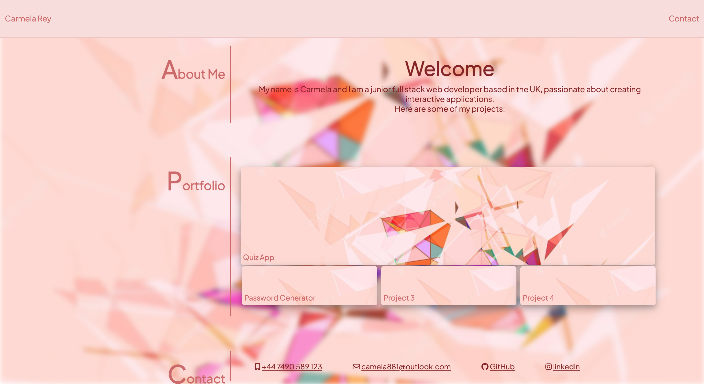

# Portfolio 

I am a junior full-stack we developer and here I have created my personal portfolio from the ground up.

## Content

This portfolio includes information about how to contact me and links to my projects.
The technologies I used to create this web app were HTML and CSS.

## Deployment
Link: [Portfolio](https://cdrcar.github.io/Portfolio-CarmelaRey/)

## Final Result

## Library
[Google Fonts](https://fonts.google.com/)

[Font Awesome](https://fontawesome.com/)

## Author
👤 Carmela Rey

GitHub: [cdrcar](https://github.com/)
## License
[MIT](https://choosealicense.com/licenses/mit/)